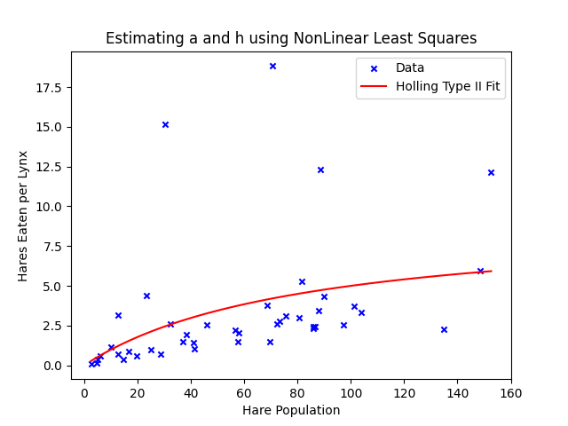
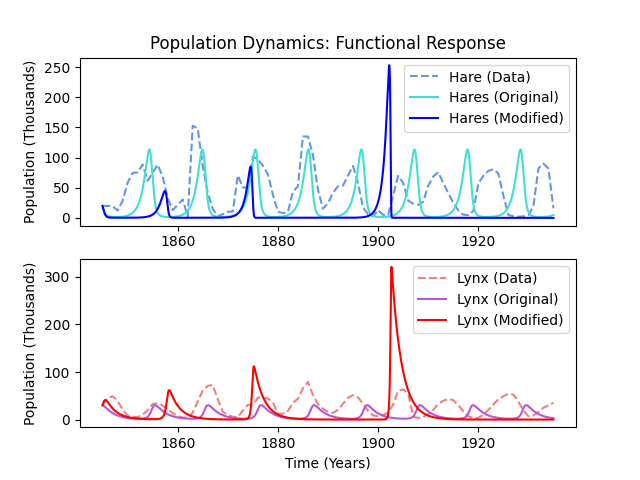
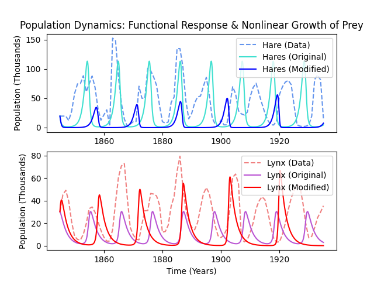
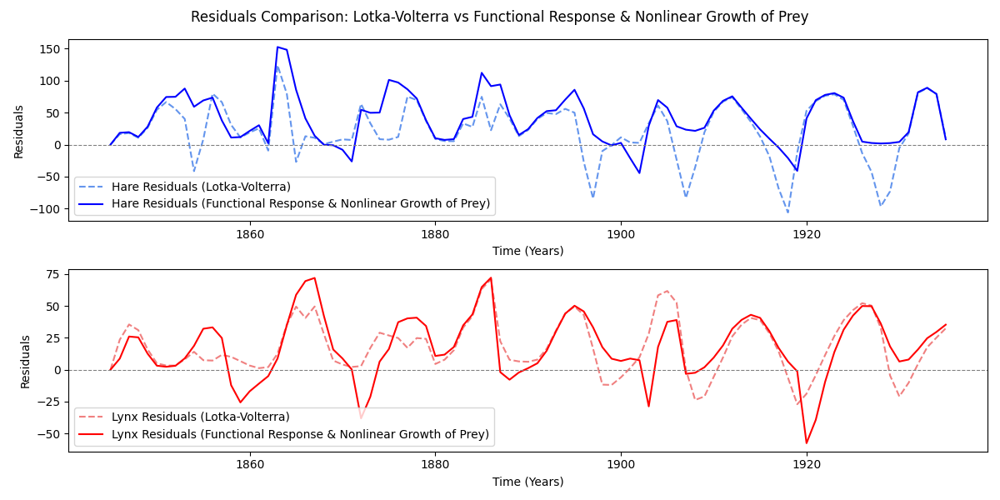

# Predator-Prey Modelling: Modified Lotka-Volterra Systems

A mathematical data modelling study critically assessing and modifying the classical Lotka-Volterra differential equations to represent historical Canadian lynx and snowshoe hare population dynamics.

Developed as part of the *Mathematical Data Modelling 1 (MDM1)* module at the **University of Bristol**.

---

## Project Overview

The classical Lotka-Volterra predator-prey system relies on highly idealized assumptions, including infinite predator appetite and exponential prey growth in the absence of predation. 

This repository focuses on addressing the **predator saturation limitation** by incorporating **Holling’s Type II Functional Response** and non-linear prey growth (carrying capacity limitations), calibrating parameters to historical pelt trade data (MacLulich, 1937).

### Mathematical Formulation

#### 1. Classical Lotka-Volterra System
$$\frac{dH}{dt} = \alpha H - \beta H L$$
$$\frac{dL}{dt} = -\gamma L + \delta H L$$

Where:
* $H$: Hare (prey) population
* $L$: Lynx (predator) population
* $\alpha, \beta, \gamma, \delta$: Growth, predation, mortality, and efficiency rates

#### 2. Holling's Type II Functional Response & Non-Linear Growth
Predators cannot feed indefinitely; consumption saturates at high prey density due to finite handling time:

$$f(H) = \frac{a H}{1 + a h H}$$

When directly incorporated, this hyperbolic response introduces destabilising runaway population spikes. To restore stability, non-linear logistic prey growth with carrying capacity $K$ is introduced:

$$\frac{dH}{dt} = \alpha H \left(1 - \frac{H}{K}\right) - \left(\frac{a H}{1 + a h H}\right) L$$

$$\frac{dL}{dt} = -\gamma L + \delta \left(\frac{a H}{1 + a h H}\right) L$$

---

## Key Results & Parameter Fitting

### 1. Non-Linear Parameter Estimation
Non-linear least squares regression was applied using `scipy.optimize` to calibrate Holling’s Type II functional response against empirical consumption records[span_0](start_span)[span_0](end_span)[span_1](start_span)[span_1](end_span):
* **Capture rate ($a$):** $0.1106$[span_2](start_span)[span_2](end_span)
* **Handling time ($h$):** $0.1096$[span_3](start_span)[span_3](end_span)



---

### 2. Identifying Destabilisation (Appetite Saturation Alone)
Directly substituting the Type II functional response without resource limits introduces a destabilising feedback loop[span_4](start_span)[span_4](end_span). Because predator feeding rate saturates at high prey density, hares experience unchecked growth, triggering an artificial population explosion (~1903) followed by dynamic collapse[span_5](start_span)[span_5](end_span):



---

### 3. Restoring Dynamic Stability with Carrying Capacity
Introducing a logistic carrying capacity ($K = 152.65$) to the prey dynamics arrests the unconstrained spikes, restoring bounded, realistic cyclic oscillations that match the empirical Hudson's Bay pelt records[span_6](start_span)[span_6](end_span):



#### Residual Analysis
Predictive performance was verified across the 90-year time series, tracking error residuals between empirical historical counts and the coupled non-linear model:




---

## Individual Contribution & Collaboration Note

This repository reflects personal code implementations and analysis conducted as part of an academic group project (Team 16). 
* **Primary Technical Focus:** Formulation, parameter estimation, non-linear least squares optimization, and dynamic stability analysis for **Holling's Type II Functional Response** (predator appetite saturation).
* **Collaborative Context:** The wider project also evaluated age-structured population distributions, finite vegetation systems, and 1D spatial diffusion models.

---

## Installation & Usage

### Requirements
* Python 3.10+
* `numpy`
* `scipy`
* `matplotlib`

```bash
git clone [https://github.com/bensen011/Lotka-Volterra-Modelling.git](https://github.com/bensen011/Lotka-Volterra-Modelling.git)
cd Lotka-Volterra-Modelling
pip install -r requirements.txt
python src/functional_response.py
```


---
## References

* MacLulich, D.A. (1937). _Fluctuations in the numbers of the varying hare(Lepus americanus)_. University of Toronto Studies.
* Holling, C.S. (1959). _The components of hte predation as revealed by a study of small-mammal predation of the European pine sawfly_. The Canadian Entomoologist
